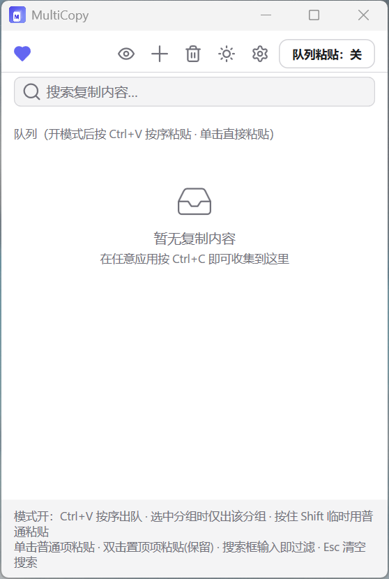

# MultiCopy

> Windows 桌面多段复制粘贴工具：连续复制多条文本，再按队列顺序或选择性粘贴。

[](LICENSE)
[](https://dotnet.microsoft.com/)
[](#)
[](../../releases)



MultiCopy 解决一个常见痛点：整理资料、填写表单、收集素材时，要在多个窗口间反复切换复制粘贴。它把你连续复制的每一段文本自动收集进队列，然后你可以按 `Ctrl+V` 一条条顺序粘贴，或点击任意条目选择性粘贴。支持文本与图片、置顶常驻、分组管理、明暗主题、托盘常驻与全局热键。

## 功能特性

- **多段连续采集**：后台监听剪贴板，每次复制自动入队，无需手动操作
- **监控开关**：一键开启/关闭剪贴板监控。最小化到托盘时自动关闭监控（避免日常复制粘贴被拦截），恢复窗口显示时自动开启
- **队列粘贴**：开启「队列粘贴」模式后，`Ctrl+V` 逐条按顺序吐出队首内容
- **选择性粘贴**：单击列表项即可粘贴该条并出队
- **置顶常驻**：双击置顶项粘贴但不出队，置顶内容持久化保存（重启不丢）
- **分组管理**：QQ 风格分组，选中分组时复制入组、粘贴只消耗该组内容
- **关键字搜索**：在搜索框输入关键字快速过滤队列，文本按内容匹配、图片按来源应用和预览信息匹配（不区分大小写），`Esc` 一键清空
- **图片支持**：采集剪贴板图片（截图、复制的图片）
- **明暗主题**：一键切换暗色 / 亮色主题
- **托盘常驻**：关闭窗口最小化到托盘，开机自启可选
- **全局热键**：默认 `Alt+Z` 随时调出 / 隐藏主窗口（可在设置中自定义）
- **单实例**：同时只允许运行一个 MultiCopy

## 界面预览

| 暗色主题 | 亮色主题 |
| --- | --- |
|  |  |

| 设置分组 | 监控 |
| --- | --- |
|  |  |

## 下载安装

### 方式一：安装包（推荐普通用户）

前往 [Releases](../../releases) 下载 `MultiCopySetup-3.8.exe`，双击安装即可。安装包支持中文界面、桌面快捷方式、开机自启选项。

### 方式二：绿色免安装

前往 [Releases](../../releases) 下载绿色版可执行.exe文件，下载后双击 `MultiCopy.exe` 直接运行（无需安装 .NET 运行时，单文件自包含）。

> 单文件 exe 约 65–70 MB（已内嵌 .NET 8 WPF 运行时），首次启动会解压到临时目录，慢 1–3 秒属正常。

## 使用说明

1. 启动 MultiCopy，它会常驻在系统托盘
2. 照常在不同窗口里 `Ctrl+C` 复制，每段文本自动进入队列
3. 点击托盘图标或按 `Alt+Z` 调出主窗口查看队列
4. 开启顶部的「按序粘贴」模式开关
5. 切到目标窗口，按 `Ctrl+V` 即可一条条顺序粘贴

### 快捷键

| 快捷键 | 作用 |
| --- | --- |
| `Alt+Z`（默认，可自定义） | 全局调出 / 隐藏主窗口 |
| `Ctrl+V`（按序粘贴模式开启时） | 粘贴队首并出队 |
| `Ctrl+Shift+V` | 逃生口：普通粘贴（不消耗队列） |
| 单击普通项 | 粘贴该项并移除 |
| 双击置顶项 | 粘贴该项但保留 |
| `Esc` | 清空搜索框 |

### 使用建议

建议在设置中开启**开机自启**。MultiCopy 常驻系统托盘，通过 `Alt+Z` 快捷键可随时调出主界面；最小化到托盘时自动停止监控剪贴板，不会影响日常复制粘贴，随用随调，且内存占用很小。

### 数据存储

- 置顶项：`%APPDATA%\MultiCopy\pinned.json`
- 设置：`%APPDATA%\MultiCopy\settings.json`

## 从源码构建

### 环境要求

- [.NET 8 SDK](https://dotnet.microsoft.com/download/dotnet/8.0)（Windows）
- （可选）[Inno Setup 6](https://jrsoftware.org/isdl.php)：用于生成安装包

### 编译运行

```powershell
git clone https://github.com/lwenlongcoder/MultiCopy.git
cd MultiCopy
dotnet build src\MultiCopy\MultiCopy.csproj
dotnet run --project src\MultiCopy\MultiCopy.csproj
```

## 技术栈

- **.NET 8** + **WPF**（Windows 桌面）
- [CommunityToolkit.Mvvm](https://github.com/CommunityToolkit/dotnet) 8.3.2 — MVVM 框架
- [Hardcodet.NotifyIcon.Wpf](https://github.com/hardcodet/wpf-notifyicon) 1.1.0 — 托盘图标
- Inno Setup 6 — 安装包打包

## 核心原理

- **复制采集**：通过 `AddClipboardFormatListener` 注册剪贴板监听，接收 `WM_CLIPBOARDUPDATE` 消息，采集纯文本（`CF_UNICODETEXT`）与图片
- **按序粘贴**：低级键盘钩子 `WH_KEYBOARD_LL` 拦截 `Ctrl+V`，把队首写入剪贴板后放行原按键，目标应用读到的就是队首内容；用标志位防止自身写入回环与模拟按键重入
- **不抢焦点**：主窗口使用 `WS_EX_NOACTIVATE` 扩展样式，点击列表项粘贴时不会抢走目标应用焦点

## 贡献

欢迎提 Issue 和 Pull Request。

## 许可证

[MIT License](LICENSE)

## 支持

如果 MultiCopy 能帮到你、让你的日常复制粘贴更顺手，不妨请作者喝杯水 ☕ 你的支持是我持续维护和优化这个工具的动力。

<p align="center">
  
</p>
